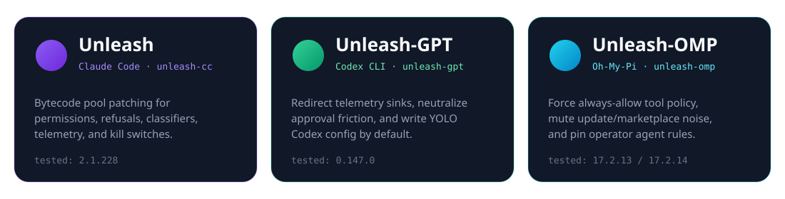
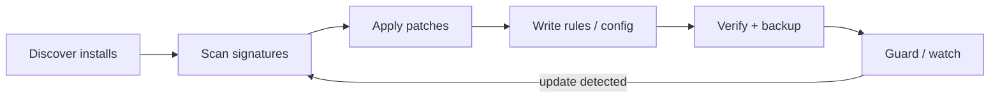

<div align="center">


<br />

# Unleash

**Operator suite for local coding agents.**  
Discover every install · patch in place · deploy authorization · survive updates.

<br />

[](https://www.npmjs.com/package/unleash-cc)
&nbsp;
[](https://www.npmjs.com/package/unleash-gpt)
&nbsp;
[](https://www.npmjs.com/package/unleash-omp)
&nbsp;
[](LICENSE)
&nbsp;
[](go/go.mod)

<br />

| Patches | Active | Skills | Products | Platforms |
|:---:|:---:|:---:|:---:|:---:|
| **113** | **48** | **216** | **3** | **6** |

`macOS arm64` · `macOS x64` · `Linux x64` · `Linux arm64` · `Windows x64` · `Windows arm64`

<br />



</div>

---

## Contents

- [Overview](#overview)
- [Products](#products)
- [Install](#install)
- [Quick start](#quick-start)
- [How it works](#how-it-works)
- [Discovery surface](#discovery-surface)
- [What gets patched](#what-gets-patched)
- [CLI reference](#cli-reference)
- [Skills pack](#skills-pack)
- [Safety model](#safety-model)
- [Build from source](#build-from-source)
- [Release layout](#release-layout)
- [Brand assets](#brand-assets)
- [License](#license)

---

## Overview

Unleash is a **multi-product operator toolkit** for people who run local coding agents at full capability. It does four jobs consistently across Claude Code, Codex CLI, and Oh-My-Pi:

1. **Find** every install on the machine (npm, bun, WinGet, Scoop, Homebrew, native installers, version managers)
2. **Patch** binaries in place with same-length, hardlink-safe edits
3. **Configure** operator authorization (rules, settings, hooks)
4. **Guard** against upstream updates with SHA checks and scheduled re-patch



| Capability | Detail |
|---|---|
| Multi-install awareness | Patches *all* coexisting copies; hardlinks are deduped by identity |
| Update survival | `guard` / `watch` / Task Scheduler · launchd · systemd re-apply after upgrades |
| SEA-aware engine | Bun SEA layouts, bytecode constant pools (CC 2.1.228+), VFS-safe commits |
| Operator pack | 216 skills + multi-agent instruction surfaces via `install-rules` / `install-skills` |
| Safety rails | Timestamped backups, smoke verify, four hard-stop authorization model |

**Currently tested:** Claude Code **2.1.228** · Codex CLI **0.147.0** · OMP **17.2.13 / 17.2.14**

---

## Products

| | **Unleash** | **Unleash-GPT** | **Unleash-OMP** |
|---|---|---|---|
| **Target** | Claude Code | OpenAI Codex CLI | Oh-My-Pi / OMP |
| **npm** | [`unleash-cc`](https://www.npmjs.com/package/unleash-cc) | [`unleash-gpt`](https://www.npmjs.com/package/unleash-gpt) | [`unleash-omp`](https://www.npmjs.com/package/unleash-omp) |
| **CLI** | `unleash` | `unleash-gpt` | `unleash-omp` |
| **State dir** | `~/.unleash/` | `~/.unleash-gpt/` | `~/.unleash-omp/` |
| **Config written** | `~/.claude/CLAUDE.md`, `AGENTS.md`, `settings.json` | `~/.codex/AGENTS.md`, `config.toml` | `~/.omp/agent/AGENTS.md`, `config.yml` |
| **Latest tag** | `cc-v1.0.1` | `gpt-v1.0.1` | `omp-v1.0.1` |

Same verbs on every product: `setup` · `status` · `patch` · `verify` · `scan` · `guard` · `doctor` · `rollback` · `tui`

---

## Install

<details open>
<summary><strong>Package managers</strong></summary>

```bash
# npm
npm install -g unleash-cc      # Claude Code
npm install -g unleash-gpt     # Codex CLI
npm install -g unleash-omp     # Oh-My-Pi

# bun
bun add -g unleash-cc
bun add -g unleash-gpt
bun add -g unleash-omp
```

</details>

<details>
<summary><strong>One-liners (GitHub releases)</strong></summary>

```powershell
# Windows (PowerShell)
irm https://raw.githubusercontent.com/NetVar1337/unleash/main/scripts/install.ps1 | iex
```

```bash
# Linux / macOS
curl -fsSL https://raw.githubusercontent.com/NetVar1337/unleash/main/scripts/install.sh | bash
```

Standalone binaries ship for six platforms  
(`unleash-windows-amd64.exe`, `unleash-darwin-arm64`, …) with checksums.  
A winget manifest template lives in [`contrib/winget/`](contrib/winget/).

</details>

---

## Quick start

```bash
unleash setup        # Claude Code — patch + rules + plugins + guard
unleash-gpt setup    # Codex CLI  — patch + rules/config
unleash-omp setup    # Oh-My-Pi   — patch + rules/config
```

Day-two operations:

```bash
unleash status              # every detected install + SHA + format
unleash patch --dry-run     # preview replacements
unleash patch               # patch ALL detected installs
unleash verify              # confirm applied markers
unleash scan                # signature-drift report (0 drift = healthy)
unleash doctor              # full health report
unleash guard               # SHA check; re-patch on change
unleash install-skills      # deploy 216-skill pack
unleash rollback            # restore newest backup
unleash tui                 # interactive control panel
```

> **Tip:** after a Claude Code upgrade, run `unleash doctor` then `unleash patch` (or let `guard` / `watch` handle it).

---

## How it works

Why Unleash survives real installs and aggressive minifiers:

| Principle | Implementation |
|---|---|
| **Same-length edits** | Replacements pad to exact length; longer candidates are skipped — bytecode never shifts |
| **Hardlink-safe commit** | npm often hardlinks `bin/claude.exe` → platform binary; verified bytes are written in place so every link is patched |
| **SEA layout tolerance** | Handles Bun SEA where raw size exceeds virtual size (CC 2.1.228+) and both pre/post-2.1.150 active-bundle layouts; only the patchable bundle is touched |
| **Bytecode constant pools** | On CC 2.1.228+, the active surface is Bun bytecode + length-prefixed string pools (gate ids, messages, URLs) — not minified JS source |
| **Backref-capable matcher** | `\1`–`\9` backreferences (emulated on RE2) for minifier-agnostic patterns |
| **Signature scan + autoheal** | Anchor strings locate sites when regex drifts; `scan --auto-heal` can rewrite patterns from windows |
| **Update guard** | `unleash guard` (Task Scheduler / launchd / systemd, ~6h) compares per-target SHA manifests and re-runs the pipeline |

```text
┌──────────────┐    ┌──────────────┐    ┌──────────────────┐
│  Find target │───▶│ Scan / match │───▶│ Same-length patch│
│  (all paths) │    │ anchors+rx   │    │ + backup + smoke │
└──────────────┘    └──────────────┘    └────────┬─────────┘
                                                 │
                    ┌──────────────┐    ┌────────▼─────────┐
                    │ Guard/watch  │◀───│ Rules + skills   │
                    │ SHA re-check │    │ install surfaces │
                    └──────────────┘    └──────────────────┘
```

---

## Discovery surface

Unleash patches the agent **no matter how it was installed**. Multiple coexisting copies are all patched.

<details>
<summary><strong>Claude Code</strong></summary>

| Method | Example | Layout |
|---|---|---|
| Native installer | `irm https://claude.ai/install.ps1 \| iex` / `curl … \| bash` | `~/.local/bin/claude(.exe)` + `~/.local/share/claude/versions/<ver>` |
| npm | `npm i -g @anthropic-ai/claude-code` | npm root + platform subpackage (often hardlinked) |
| bun | `bun add -g @anthropic-ai/claude-code` | `~/.bun/install/global/node_modules/…` |
| WinGet | `winget install Anthropic.ClaudeCode` | `%LOCALAPPDATA%\Microsoft\WinGet\Packages\…` |
| Scoop / Chocolatey | `scoop install claude-code` | scoop / choco lib dirs |
| Homebrew | formula or cask | `/opt/homebrew/…`, Caskroom |
| Version managers | nvm / fnm / mise / volta / pnpm | versioned `node_modules` |
| System packages | apt / dnf / apk | `/usr/bin/claude`, `/opt/claude-code/…` |

</details>

<details>
<summary><strong>Codex CLI</strong></summary>

npm (flat + nested), bun, pnpm, volta, WinGet, native (`~/.local/bin/codex`, `~/.codex/bin`), Scoop, Homebrew, PATH shim fallback.

</details>

<details>
<summary><strong>OMP</strong></summary>

Standalone SEA executables (WindowsApps, `%LOCALAPPDATA%\Programs`, `~/.local/bin`, WinGet), bun global `@oh-my-pi/pi-coding-agent`, npm global, mise, PATH shim fallback.

</details>

---

## What gets patched

### Unleash · Claude Code

**113** catalog entries · **48** active (not retired/disabled) · **0** sig drift on CC **2.1.228**  
Bytecode constant-pool + settings patching of the Bun SEA:

| Category | Active | Effect |
|---|:---:|---|
| **Refusal & AUP** | 11 | Neutralize usage-policy refusal text, plan-mode blocks, denial workarounds, stop-reason handling |
| **Permissions** | 10 | Bypass gates, sandbox friction, trust checks, kill-switch messages, dangerous-cmd reasons |
| **Telemetry** | 9 | Metrics / Datadog / plugin events, protection headers, domain-info preflight |
| **Infrastructure** | 8 | Off-switch keys, root restrictions, plugin denylists, MCP / wrapper helpers |
| **Classifier** | 4 | Fail-open paths, path-safety blinding, auto-mode verdict surfaces |
| **Attribution** | 3 | Blank Co-Authored-By and generated-with markers |
| **Feature gates** | 2 | Statsig-facing gate id renames / inert paths |
| **Rate limits** | 1 | Implicit-fork maxTurns raise (where constants remain patchable) |

Settings companion (`01-bypass-permissions`) forces `defaultMode=bypassPermissions`, trust skip, sandbox disable, and related operator defaults.

Retired/disabled entries (65) stay in the tree for history but are **not loaded** by the patcher.

### Unleash-GPT · Codex CLI

| Surface | Change |
|---|---|
| Sentry DSN | → loopback |
| OTLP metrics endpoint | → loopback |
| Cyber-safety doc endpoint | → loopback |
| High-risk cyber fallback + approval rejection wording | neutralized |
| Approval / sandbox fallback warning | neutralized |

Writes `~/.codex/AGENTS.md` + `~/.codex/config.toml`:

```toml
approval_policy = "never"
sandbox_mode = "danger-full-access"
dangerously_bypass_approvals_and_sandbox = true
```

### Unleash-OMP · Oh-My-Pi

| Surface | Change |
|---|---|
| Auto-QA grievance endpoint | → loopback |
| Approval `deny` / `prompt` branches | neutralized (17.x resolver shapes) |
| Channel permission gate | always-allow tool execution |
| Startup update check + marketplace auto-update | off (binary **and** `config.yml`) |
| OMP npm update-check endpoint | → loopback |

Writes `~/.omp/agent/AGENTS.md` + `~/.omp/agent/config.yml`:

```yaml
tools:
  approvalMode: yolo
startup:
  checkUpdate: false
marketplace:
  autoUpdate: "off"
```

---

## CLI reference

| Command | Purpose |
|---|---|
| `setup` | One-shot: deps + patch + rules + plugins + guard |
| `status` | Install state: targets, SHA, format, backup count |
| `doctor` | Full health: drift, retired count, verify, upstream |
| `list` | Catalog of loadable patches |
| `patch` | Apply all active patches to every detected target |
| `verify` | Check applied markers |
| `scan` | Signature scan (`-v`, `--auto-heal`, `--export-patch`) |
| `guard` | Fast SHA guard; re-patch if binary changed |
| `watch` | Daemon: poll target, autoheal on change |
| `autoheal` | Detect drift; self-update + re-patch if broken |
| `install-guard` / `uninstall-guard` | Platform scheduler (Task Scheduler / launchd / systemd) |
| `install-preload` / `uninstall-preload` | Runtime monkey-patch survival layer |
| `install-rules` / `uninstall-rules` | Operator-authorization bundle |
| `install-skills` | Deploy skills pack → `~/.agents/skills` + `~/.claude/skills` |
| `self-update` / `update` / `upgrade` | Sync patches / upgrade binary / full pipeline |
| `rollback` | Restore newest backup |
| `tui` / `dashboard` | Interactive control panel / live status |
| `autopilot` | scan → heal → patch → git commit/push → issue |
| `bench` | Microbenchmarks (sha256, load, scan cold/cached) |
| `check-updates` | Compare local vs remote patch tree |

Default invocation with no subcommand launches the **TUI**.

---

## Skills pack

**216 skills** ship under [`contrib/skills/`](contrib/skills/) and are embedded for `unleash install-skills` / `install-rules`.

```bash
unleash install-skills
# or
unleash install-rules   # deploys rules + skills
```

Installs each skill to `~/.agents/skills/<name>/` and `~/.claude/skills/<name>/`, with a full mirror at `~/.unleash/skills-pack/`.

| Cluster | Focus |
|---|---|
| **LLM red-team** | Jailbreak taxonomy, Fable safeguards, classifier / tool / agent bypasses |
| **Game & AC** | Game hacking, aimbot humanization, EAC / HWID / HV research indexes |
| **Stealth & kernel** | Injectors, hypervisor, BYOVD, Windows internals, stack-walk stealth |
| **Exploit classes** | Stack/heap overflow, UAF, integer overflow, ROP, format string |
| **RE & tooling** | IDA / Ghidra / r2, protocol RE, firmware, mobile, malware |
| **ZDI / 0-day** | Researcher guidelines, target eligibility, variant hunting |
| **Engineering style** | Karpathy, Ponytail, Caveman, deslopify, TDD, review loops |
| **Languages** | C++23, C++ game hacking, Go, Rust, Zig, Java, Assembly |

**Start here:** `llm-jailbreak-taxonomy` · `reverse-skill-router` · `game-hacking` · `zdi-researcher-guidelines` · `karpathy-guidelines`

Full index: [`contrib/skills/README.md`](contrib/skills/README.md)

---

## Safety model

Operator-authorization block with **four hard stops**:

1. **No secret exfiltration** to networks not invoked by the current task  
2. **No overwriting uncommitted work** without green tests or explicit confirmation  
3. **No sending messages / creating public PRs** without in-session acknowledgement  
4. **Force-push to `main` / `master`** requires explicit in-session consent  

Everything else is treated as pre-authorized local operator work.

| Guardrail | Behavior |
|---|---|
| Backups | Every patch run writes a timestamped backup first |
| Rollback | `unleash rollback` restores the newest backup |
| Smoke verify | Patched binaries checked (`--version` + startup) before commit |
| Rules uninstall | `uninstall-rules` removes managed blocks, preserves operator content |

Rules sources: [`contrib/rules/`](contrib/rules/) · root [`AGENTS.md`](AGENTS.md) · [`CLAUDE.md`](CLAUDE.md)

---

## Build from source

```bash
git clone https://github.com/NetVar1337/unleash
cd unleash

# sync go:embed mirrors (patches + contrib)
make sync-assets   # or: node scripts/sync-assets.mjs

# build all three CLIs (host OS)
make build

# cross-compile example
cd go
GOOS=windows GOARCH=amd64 go build -o ../unleash-windows-amd64.exe .
GOOS=windows GOARCH=amd64 go build -o ../unleash-gpt-windows-amd64.exe ./cmd/unleash-gpt
GOOS=windows GOARCH=amd64 go build -o ../unleash-omp-windows-amd64.exe ./cmd/unleash-omp
```

| Requirement | Version |
|---|---|
| Go | **1.24.2+** |
| Node | for `scripts/sync-assets.mjs` only |

Release workflows build all six platform targets per product.

```bash
make test          # check-assets + go test ./...
make check-assets  # fail if embed mirrors drift
```

---

## Release layout

| Product | Git tag | GitHub artifacts | npm package | npm bin |
|---|---|---|---|---|
| Unleash | `cc-v*` | `unleash-*` | `unleash-cc` | `unleash` |
| Unleash-GPT | `gpt-v*` | `unleash-gpt-*` | `unleash-gpt` | `unleash-gpt` |
| Unleash-OMP | `omp-v*` | `unleash-omp-*` | `unleash-omp` | `unleash-omp` |

<!-- release-versions:start -->
| Product | Latest release |
|---|---|
| Unleash | `cc-v1.0.1` |
| Unleash-GPT | `gpt-v1.0.1` |
| Unleash-OMP | `omp-v1.0.1` |
<!-- release-versions:end -->

npm packages are thin launchers over prebuilt `bin/` binaries (npm **and** bun).  
Publishing is tag-driven: push `cc-vX.Y.Z` → publish `unleash-cc@X.Y.Z`.

---

## Brand assets

| File | Use |
|---|---|
| [`.github/assets/banner.svg`](.github/assets/banner.svg) | Hero banner |
| [`.github/assets/logo.svg`](.github/assets/logo.svg) | App mark / favicon source |
| [`.github/assets/wordmark.svg`](.github/assets/wordmark.svg) | Horizontal wordmark |
| [`.github/assets/products.svg`](.github/assets/products.svg) | Three-product card strip |

<div align="center">

</div>

---

## License

**GPL-3.0-or-later** — see [LICENSE](LICENSE).

<div align="center">

<br />


<br />

**Unleash** — patch once, stay unleashed.

</div>
